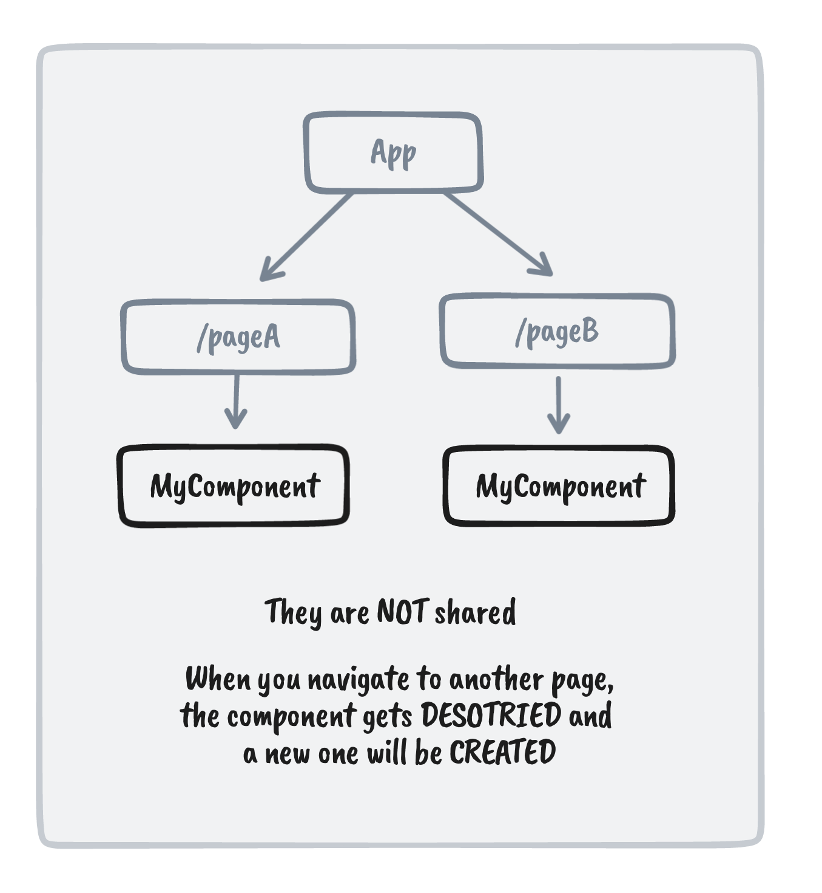
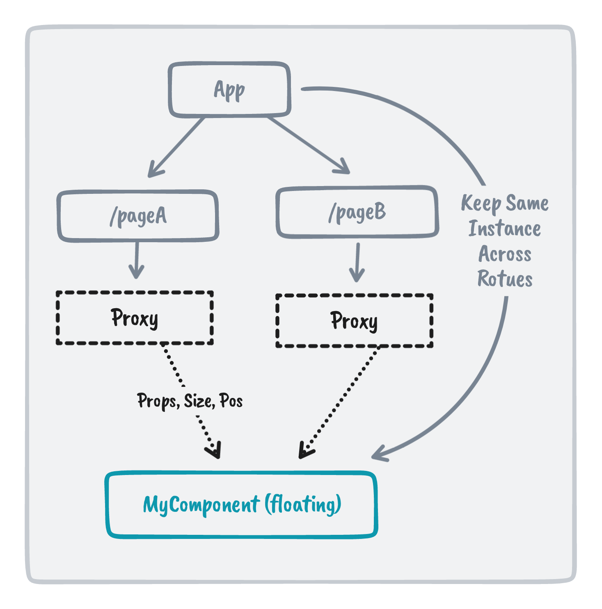

<br>
<br>
<p align="center">

</p>

<p align="center">
Shared Vue component across routes with animations
</p>

<p align="center"><a href="https://www.npmjs.com/package/vue-starport"></a></p>

<p align="center"><a href="https://vue-starport.netlify.app/">Live Demo</a></p>
<p align="center">English | <a href="./README.zh-Hans.md">简体中文</a></p>

<br>
<br>

## Why?

It's quite common you might have a same component used in different routes (pages) with a bit different sizes and positions. Sometimes you might want to animate them when user navigates between routes to provide a smooth UX. While such animation is common to be seen in native apps, it's could be a bit challenging to do it in Web.

Vue's component structure is presented as a **tree**, and the child components are in different branches with their own instances. Meaning when users navigate between routes, the components are not shared across routes.

<p align="center">

</p>

By that means you can't directly animate the changes because they are in two different instances. The good news is, there is a technique called [FLIP](https://github.com/googlearchive/flipjs) to enumerate the transitions between them.

However, FLIP only solves the problem of transitions, the components are still not the same. During the navigation, the internal state of the component will lost.

Thus I started this new approach **Starport** to experiment with a better solution to fit this requirement.

## How?

So since we can't share the components across different branches in the component tree, we could actually hoist them to the root so they become independent from the routes.

To allow each page to still have control of the components, we introduced a **Proxy component** to present the expected size and position of that component. The proxy will pass the props and position information to the actual component and let it "fly over" the proxy with animations.

<p align="center">

</p>

When the transition ends and it arrived to the expected position, it will then "land down" to the actual component using the [`<Teleport/>`](https://vuejs.org/guide/built-ins/teleport.html) component.

<p align="center">

</p>

With this "landing" mechanism, the DOM tree will be preserved as what you will have with the original tree structure. When navigating to another route, the component then will "lift off" back to the floating state, "fly" to the new proxy's position and "land" again.

This is very similar to [Terran's Buildings](https://starcraft.fandom.com/wiki/Lift_Off) in [StarCraft](https://starcraft2.com/) (able to leave the ground and fly to new locations). It's also the inspiration source of the project name [**Starport**](https://starcraft.fandom.com/wiki/Starport).

<p align="center">

</p>

## Install

> ⚗️ **Experimental**

```
npm i vue-starport
```

> Vue Starport only works for Vue 3

## Usage

Add `<StarportCarrier>` component from `vue-starport` to your root component (`app.vue`). All `<Startport>` usage should be inside `<StarportCarrier>` component.

```html
<script setup>
import { StarportCarrier } from 'vue-starport'
</script>

<template>
  <StarportCarrier> <!-- here -->
    <RouterView />
  </StarportCarrier>
</template>
```

In routes, wrap the component with the `<Starport>` component.

```html
<!-- PageA.vue -->
<script setup>
import { Starport } from 'vue-starport'
</script>

<template>
  <div>
    <!-- ... -->
    <Starport port="my-id" style="height:400px"> 
      <MyComponent :prop="value"/>
    </Starport>
  </div>
</template>
```

On the other page, we do the same thing with **the same `port` id** to identify the instance.

```html
<!-- PageB.vue -->
<script setup>
import { Starport } from 'vue-starport'
</script>

<template>
  <div>
    <!-- ... -->
    <Starport port="my-id" style="height:600px">
      <MyComponent :prop="value"/>
    </Starport>
  </div>
</template>
```

> Note that you might need to apply some styles to `<Starport>` to make it have a defined size indicating the area for the "floating starcraft" to land.

Checkout the [Playground](./playground/) for more examples.

### Register Components Globally

```ts
// main.ts
import StarportPlugin from 'vue-starport'

app.use(StarportPlugin())
```

And then you can use `Starport` and `StarportCarrier` components without importing.

### Keep Alive

By default, when navigating to a page without a corresponding `<Starport>` proxy to land, the component will be destroyed. If you want to keep the component alive even when it's not presented in the current route, you can set `keepAlive` to `true` for that specific instance.

```html
<Starport keep-alive port="my-id">
  <MyComponent />
</Starport>
```

To configure it globally, you can pass options to the plugin:

```ts
// main.ts
import StarportPlugin from 'vue-starport'

app.use(StarportPlugin({ keepAlive: true }))
```

## Debug

To debug what happens during the transition, you can add the follow CSS to highlight the parts

```css
[data-starport-craft] {
  background: #0805;
}
[data-starport-proxy]:not([data-starport-landed]) {
  background: #8005;
}
```

## Special Thanks

Thanks to [@hangsman](https://github.com/hangsman) who helped to provide the initial solution of proper teleport the element and made this idea valid. Also thanks to the viewers of [my live-streaming on Bilibili](https://space.bilibili.com/668380), those who spend time with me to working on this idea and provided useful feedback during the live.

You can check [the recordings of my live-streams (in Chinese)](https://www.bilibili.com/video/BV1na41147qR), where I wrote this project from scratch.

你可以在哔哩哔哩观看我实现此项目的 [直播录像](https://www.bilibili.com/video/BV1na41147qR)。

## Sponsors

<p align="center">
  <a href="https://cdn.jsdelivr.net/gh/antfu/static/sponsors.svg">
    
  </a>
</p>

## License

[MIT](./LICENSE) License © 2022 [Anthony Fu](https://github.com/antfu)
