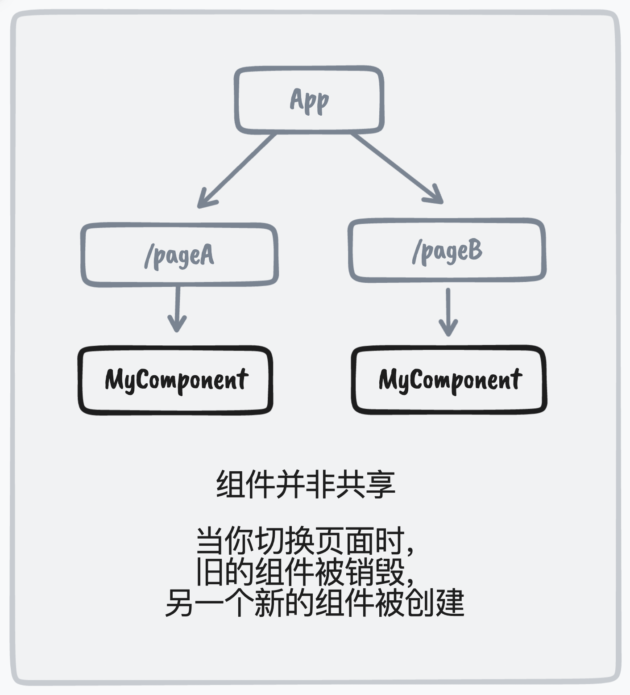
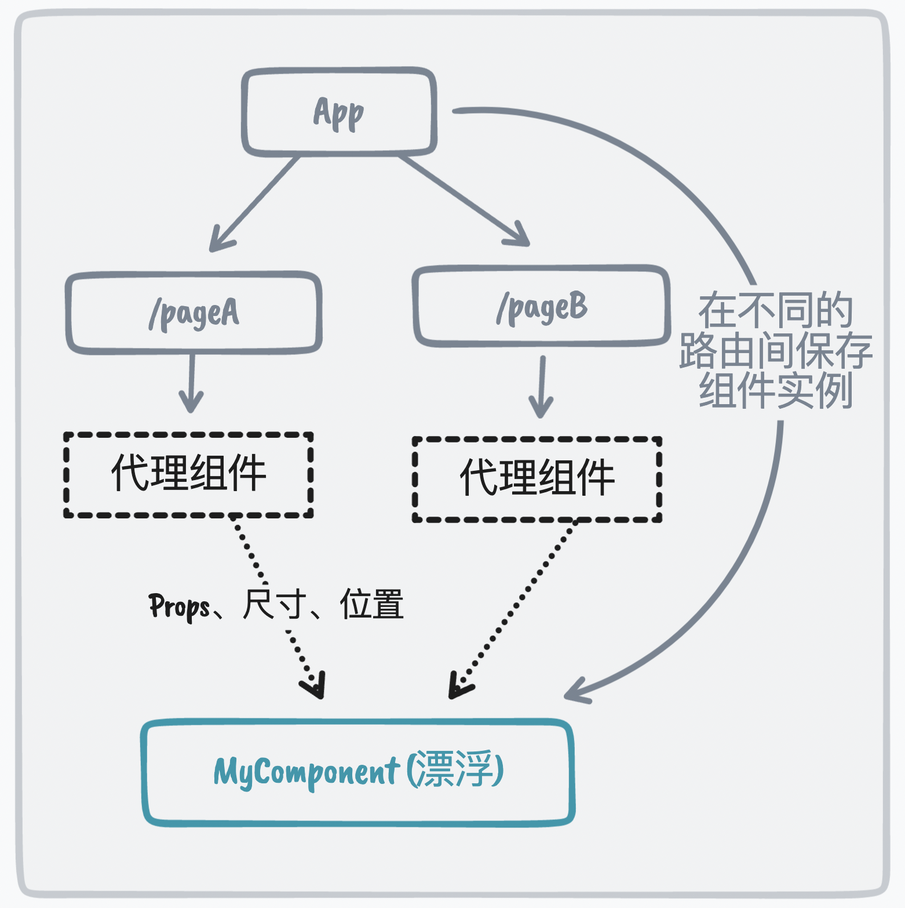
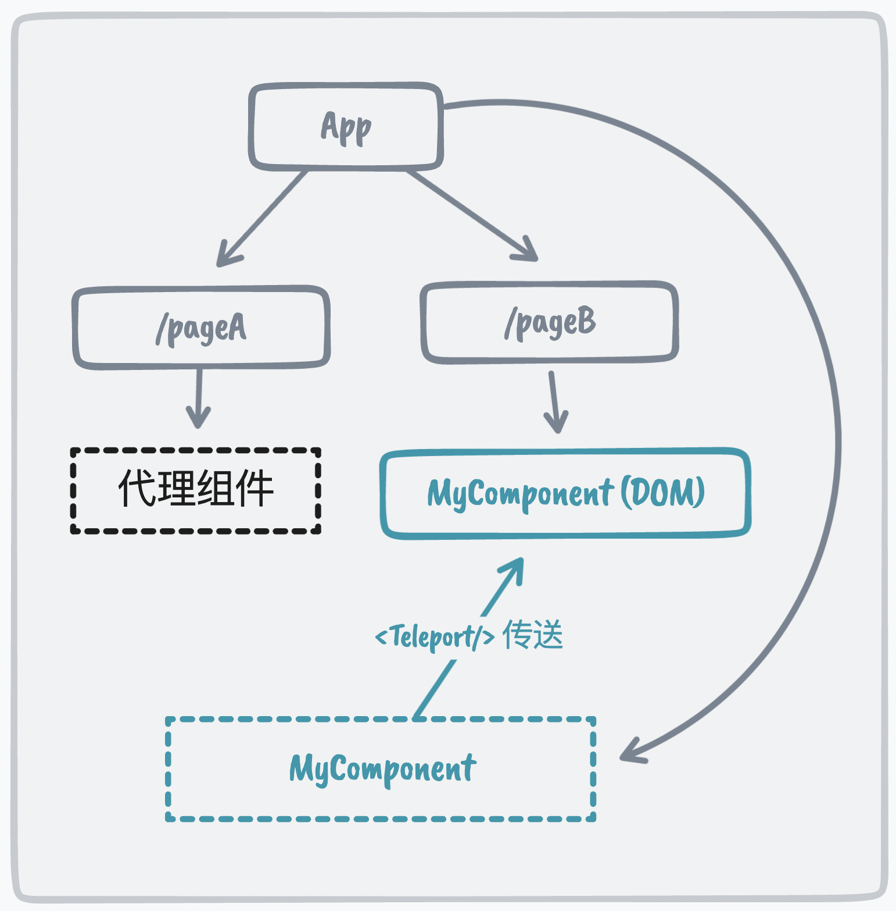
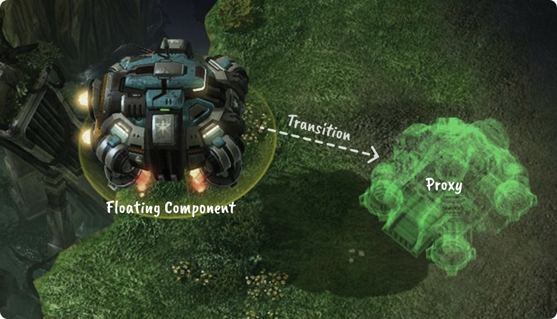

<br>
<br>
<p align="center">

</p>

<p align="center">
Vue 跨路由组件共享
</p>

<p align="center"><a href="https://www.npmjs.com/package/vue-starport"></a></p>

<p align="center"><a href="https://vue-starport.netlify.app/">在线示例</a></p>
<p align="center"><a href="./README.md">English</a> | 简体中文</p>

<br>
<br>

## 由来

我们经常会在在不同的路由（页面）上使用统一组件，但他们的位置和大小可以不尽相同。这时你可能会希望在用户进行路由跳转时，想让它们展示流畅的过渡动画。尽管这样的动画在原生应用中较为常见，但要在 Web 中实现却有一些挑战。

Vue 的组件结构以 **树** 的形式呈现，在不同分支中的子组件有其各自的实例，这意味着当用户在路由之间跳转时，同样的组件并不会跨路由共享。

<p align="center">

</p>

因为它们是两个不同的实例，这意味着你无法直接为它们的添加补间动画。幸运的是，有一种叫做 [FLIP](https://github.com/googlearchive/flipjs) 的技术可以模拟不同组件之间的过渡动画。

然而，FLIP 只解决了过渡的问题，我们仍然还是会有两个组件实例。在跳转过程中，组件的内部状态将会丢失。

因此，我开始实验一个新的解决方案用于满足这一需求，并将其取名为 **Starport**。

## 解决方案

既然我们无法在组件树的不同分支之间共享组件，我们其实上可以将组件提升到根节点上，从而它们独立于路由而存在。

为了让每个页面仍然可以控制组件，我们引入了一个 **代理组件** 来表示该组件的预期大小和位置。代理组件将把 props 和位置信息传递给真实的组件，并让它通过补间动画 “飞” 到代理组件的位置。

<p align="center">

</p>

当动画结束并且它到达预期位置时，它将使用 [`<Teleport/>`](https://vuejs.org/guide/built-ins/teleport.html) 组件来 “着陆” 到 DOM 树的实际节点。

<p align="center">

</p>

有了这种 “着陆” 的机制，DOM 树将保留原始的结构。当跳转到另一路由时，组件又将 “起飞” 变回漂浮的状态，“飞行” 到新的位置，然后再次 “着陆”。

这与[星际争霸](https://starcraft2.com/)中的[人族建筑](https://starcraft.fandom.com/wiki/Lift_Off)非常相似（能够离开地面飞往新地点）,它也是项目名称[**Starport**](<(https://starcraft.fandom.com/wiki/Starport)>)的灵感来源。

<p align="center">

</p>

## 安装

> ⚗️ **实验性**

```
npm i vue-starport
```

> Vue Starport 仅支持 Vue 3

## 使用

从 `vue-starport` 导出并添加 `<StarportCarrier>` 组件到根组件 (`app.vue`)。 所有的 `<Startport>` 组件调用需要在 `<StarportCarrier>` 组件内部。

```html
<script setup>
  import { StarportCarrier } from "vue-starport";
</script>

<template>
  <StarportCarrier> <!-- 这里 -->
    <RouterView />
  </StarportCarrier>
</template>
```

在路由中，使用 `<Starport>` 来包装组件。

```html
<!-- PageA.vue -->
<script setup>
  import { Starport } from "vue-starport"
</script>

<template>
  <div>
    <!-- ... -->
    <Starport port="my-id" style="height:400px">
      <MyComponent :prop="value" />
    </Starport>
  </div>
</template>
```

在另一个路由上，我们使用 **相同的 `port` ID** 让 Starport 得以进行匹配。

```html
<!-- PageB.vue -->
<script setup>
  import { Starport } from "vue-starport";
</script>

<template>
  <div>
    <!-- ... -->
    <Starport port="my-id" style="height:600px">
      <MyComponent :prop="value" />
    </Starport>
  </div>
</template>
```

> 请注意，你可能需要对 `<Starport>` 添加一些样式，使其在没有内容时也能拥有的大小从而指示着陆的区域。

查看 [Playground](./playground/) 以获取更多示例。

### 全局组件注册

```ts
// main.ts
import StarportPlugin from 'vue-starport'

app.use(StarportPlugin())
```

然后你可以在不导入的情况下使用 `<Starport>` 与 `<StarportCarrier>` 组件。

### 组件持久化

默认情况下，当跳转到没有相应 `<Starport>` 代理着陆的页面时，组件将被销毁。如果你想在组件没有出现在当前路由中时仍然保留组件的状态，你也可以将该实例的 `keepAlive` 设置为 `true`。

```html
<Starport keep-alive port="my-id">
  <MyComponent />
</Starport>
```

要全局配置它，你可以在插件中设置：

```ts
// main.ts
import StarportPlugin from 'vue-starport'

app.use(StarportPlugin({ keepAlive: true }))
```

## 调试

要调试过渡动画，你可以添加以下 CSS 来突出显示部件

```css
[data-starport-craft] {
  background: #0805;
}
[data-starport-proxy]:not([data-starport-landed]) {
  background: #8005;
}
```

## 鸣谢

感谢 [@hangsman](https://github.com/hangsman)，他帮助提供了使用 `<Teleport>` 的最初解决方案，从而让这个想法得以实装。也感谢 [我在 Bilibili 的直播](https://space.bilibili.com/668380)观众，与我一起研究这个想法并在直播期间提供了许多宝贵的反馈。

你可以在哔哩哔哩观看我实现此项目的 [直播录像](https://www.bilibili.com/video/BV1na41147qR)。

## 赞助者

<p align="center">
  <a href="https://cdn.jsdelivr.net/gh/antfu/static/sponsors.svg">
    
  </a>
</p>

## License

[MIT](./LICENSE) License © 2022 [Anthony Fu](https://github.com/antfu)
