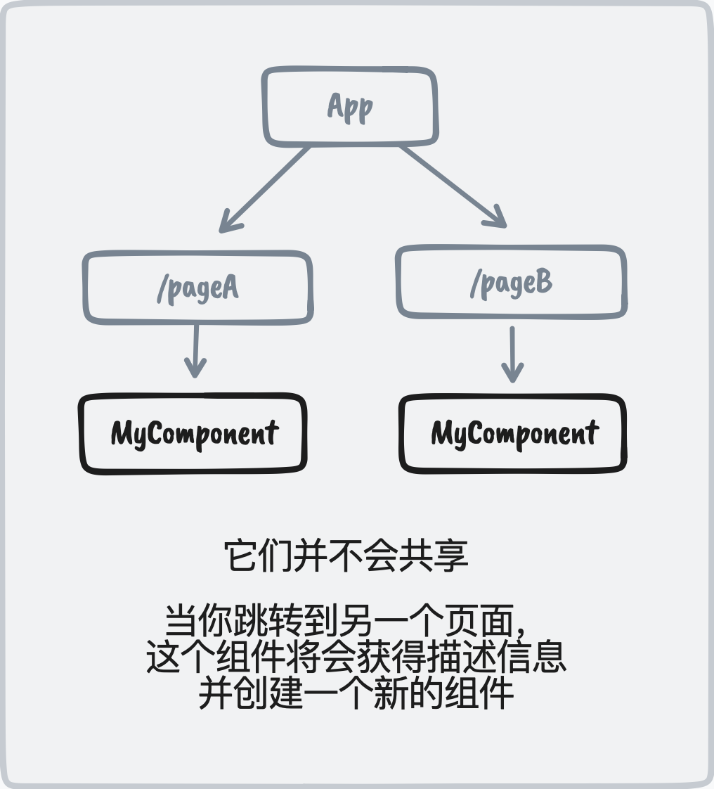
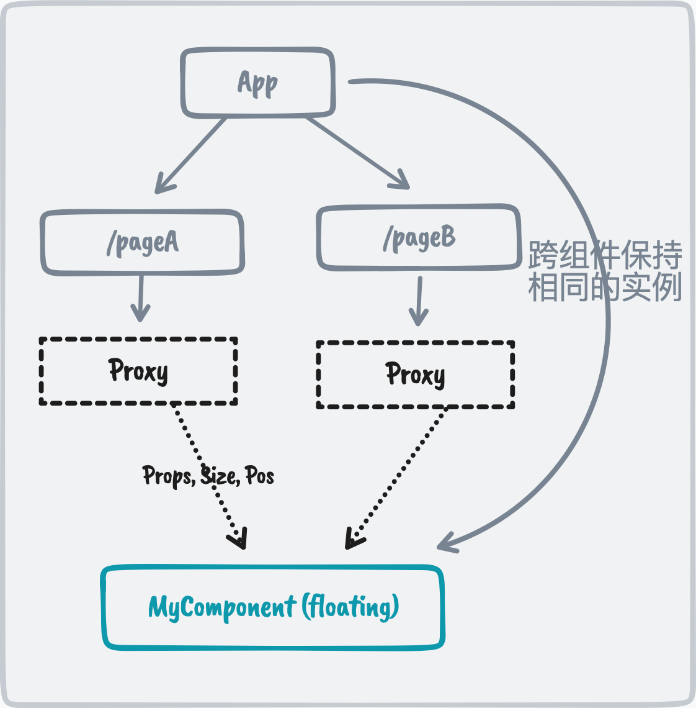
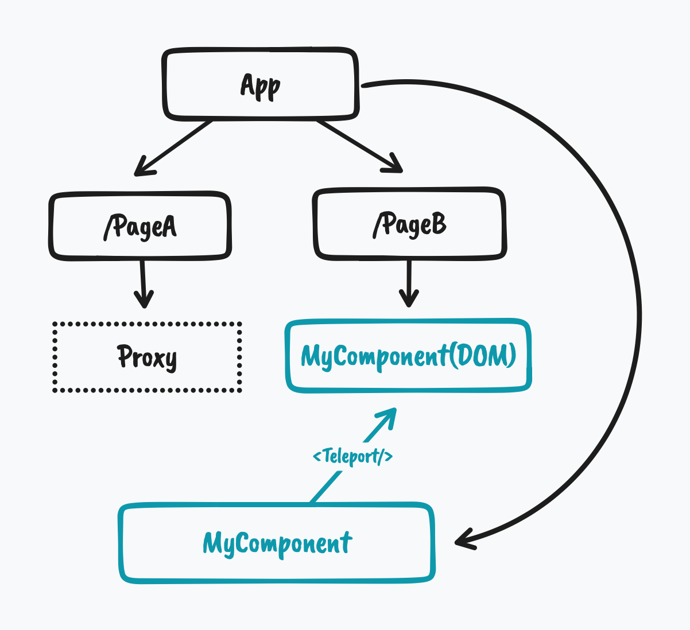

<br>
<br>
<p align="center">

</p>

<p align="center">
Vue跨路由共享组件
</p>

<p align="center"><a href="https://www.npmjs.com/package/vue-starport"></a></p>

<p align="center"><a href="https://vue-starport.netlify.app/">Live Demo</a></p>
<p align="center"><a href="./README.md">English</a></p>

<br>
<br>

## 由来

在不同的路由（页面）上使用仅有细微差距的组件，比如说它们的大小和位置，这是很常见的。这时你可能会想让它们在用户进行路由跳转时，展示流畅的过渡动画。虽然这种动画在原生应用中很常见，但在 Web 中确会有一些挑战。

Vue 的组件结构以**树**的形式呈现，子组件在不同分支中有各自的实例，这意味着当用户在路由之间跳转时，组件不会跨路由共享。

<p align="center">

</p>

这意味着你无法直接为它们的更改添加动画效果，因为它们是两个不同的实例。令人开心的是，有一种叫做[FLIP](https://github.com/googlearchive/flipjs)的技术来列举它们之间的过渡。

然而，FLIP 只解决了过渡的问题，组件仍会有些差别。在跳转过程中，组件的内部状态将会丢失。

因此，我开始尝试名叫**Starport**的方法，一个满足这一需求更好的解决方案。

## 方案

因此，由于我们无法在组件树的不同分支之间共享组件，我们实际上可以将它们提升到根组件上，以便它们独立于路由而存在。

为了让每个页面仍然可以控制组件，我们引入了一个**代理组件**来显示该组件的预期大小和位置。代理组件将把 props 和位置信息传递给真实的组件，并让它准备“起飞”。

<p align="center">

</p>

当过渡结束并且它到达预期位置时，它将使用[`<Teleport/>`](https://vuejs.org/guide/built-ins/teleport.html)组件“着陆”到目标位置。

<p align="center">

</p>

有了这种“着陆”机制，DOM 树将保留为原始树结构。当跳转到另一路由时，组件又将“起飞”变回浮动状态，“飞行”到新代理的位置，然后再次“着陆”。

这与[星际争霸](https://starcraft2.com/)中的[人族建筑](https://starcraft.fandom.com/wiki/Lift_Off)非常相似（能够离开地面飞往新地点）,它也是项目名称[**Starport**](<(https://starcraft.fandom.com/wiki/Starport)>)的灵感来源。

<p align="center">

</p>

## 安装

> ⚗️ **实验性**

```
npm i vue-starport
```

> Vue Starport 仅支持 Vue 3

## 实用

在`App.vue`根组件处,从`vue-starport`导出并添加`<StarportCarrier>`组件到 DOM 末尾处。 `<StarportCarrier>`将是存放所有飞行组件的地方。

```html
<script setup>
  import { StarportCarrier } from "vue-starport";
</script>

<template>
  <RouterView />
  <StarportCarrier />
  <!-- 这里 -->
</template>
```

在路由中，使用 `<Starport>` 来包装组件。

```html
<!-- PageA.vue -->
<script setup>
  import { Starport } from "vue-starport";
</script>

<template>
  <div>
    <!-- ... -->
    <Starport port="my-id" style="height:400px">
      <MyComponent :prop="value" />
    </Starport>
  </div>
</template>
```

在另一页上，我们使用**相同的 `port` ID**做同样的事情来识别实例。

```html
<!-- PageB.vue -->
<script setup>
  import { Starport } from "vue-starport";
</script>

<template>
  <div>
    <!-- ... -->
    <Starport port="my-id" style="height:600px">
      <MyComponent :prop="value" />
    </Starport>
  </div>
</template>
```

> 请注意，你可能需要对 `<Starport>` 应用一些样式，使其具有指定的大小，指示“浮动战舰”着陆的区域。

查看[Playground](./playground/)以获取更多示例。

### 注册全局组件

```ts
// main.ts
import StarportPlugin from "vue-starport";

app.use(StarportPlugin());
```

然后你可以在不导入的情况下使用`Starport`与`StarportCarrier`方法。

### 状态持久化

默认情况下，当跳转到没有相应`<Starport>`代理着陆的页面时，组件将被销毁。如果你想保持组件的状态，即使它没有在当前路由中显示，你也可以为该需求将实例的`keepAlive`设置为`true`。

```html
<Starport keep-alive port="my-id">
  <MyComponent />
</Starport>
```

要全局配置它，你可以将选项传递给插件：

```ts
// main.ts
import StarportPlugin from "vue-starport";

app.use(StarportPlugin({ keepAlive: true }));
```

## 调试

要调试过渡动画，你可以添加以下 CSS 来突出显示部件

```css
[data-starport-craft] {
  background: #0805;
}
[data-starport-proxy]:not([data-starport-landed]) {
  background: #8005;
}
```

## 鸣谢

感谢[@hangsman](https://github.com/hangsman)，他帮助提供了正确传送元素的初始解决方案，并使这个想法有效。也感谢[我在 Bilibli 的直播](https://space.bilibili.com/668380)观众，那些花时间和我一起研究这个想法并在直播期间提供了有用的反馈的人。

你可以查看我的[直播录像](https://www.bilibili.com/video/BV1na41147qR)，记录了我从零开始制作这个项目的过程。

你可以在哔哩哔哩观看我实现此项目的 [直播录像](https://www.bilibili.com/video/BV1na41147qR)。

## 赞助者

<p align="center">
  <a href="https://cdn.jsdelivr.net/gh/antfu/static/sponsors.svg">
    
  </a>
</p>

## 协议

[MIT](./LICENSE) License © 2022 [Anthony Fu](https://github.com/antfu)
